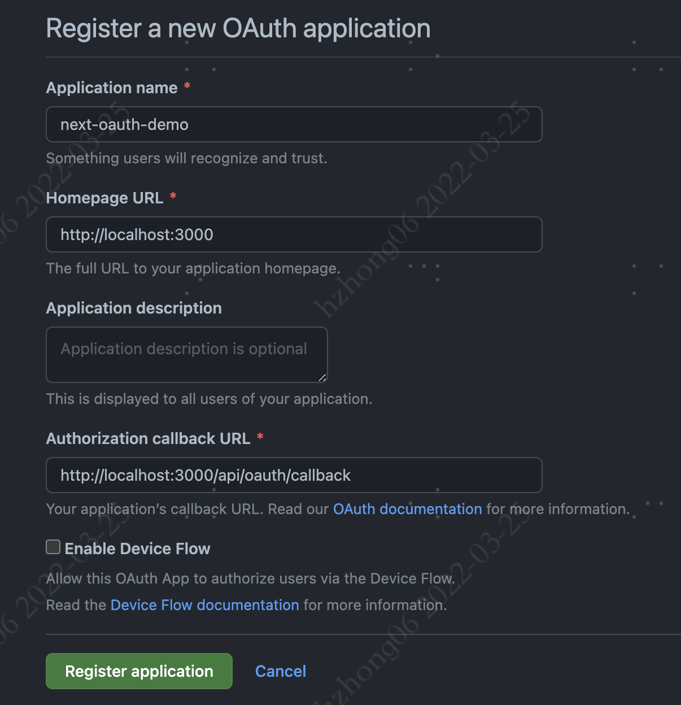

# next-oauth-demo

## github 建立 oauth 应用

<https://github.com/settings/applications/new>

获取 Client ID 和 Client secret

## 修改变量

1. 更改.env 中的 NEXT_PUBLIC_CLIENT_ID
2. 建立.env.local 的 CLIENT_SECRET
3. pnpm dev
